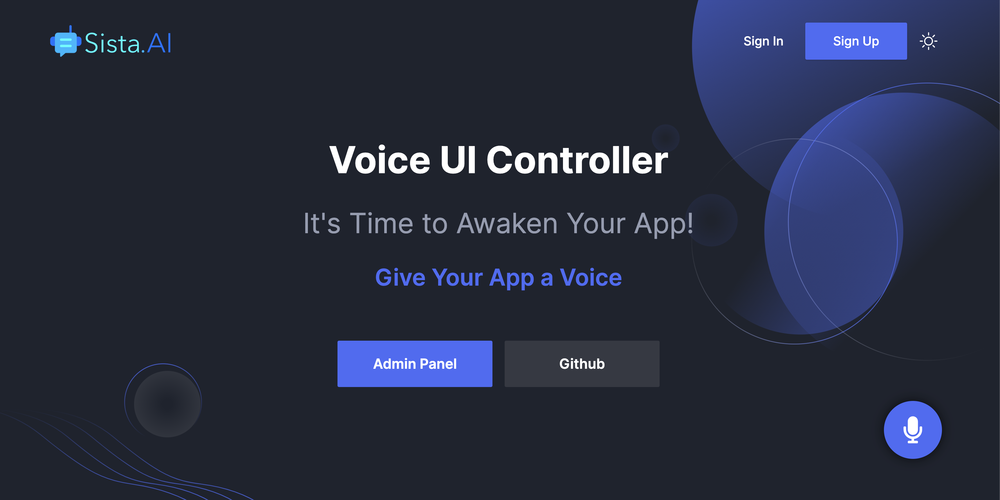

# AI Voice Assistant (React JS)

Give your App a voice, with a conversational AI assistant and interactive voice UI **in less than 10 minutes**!

**No Code Changes! No Intent Definitions!** _Just add our magic button `<AiAssistantButton />`._

## Demo (Try it now!)

Visit our [Demo](https://smart.sista.ai) _Say "Turn light on"!_

[](https://smart.sista.ai)

> Sista AI: 🤖 Your AI Integration Platform. ❤️

## Plug & Play AI Integration

Incorporating AI into your applications is now simpler than ever. Our seamless AI integration platform allows you to enhance your apps with intelligent features and voice capabilities.

### Features at a Glance

-   **AI Assistant:** Answers any question
-   **UI Controller:** Performs any action
-   **Voice UI:** Speaks any language
-   **Auto Scraper:** Scrape any page
-   **Admin Panel:** Customizes any detail

### Supported Frameworks

This package integrates seamlessly with a wide range of React projects, including **NextJS**, **Electron**, **Gatsby**, **Meteor**, **React Native**, **Remix**, **RedwoodJS**, **Parcel**, **Expo**, and **BlitzJS**.

<a href="https://smart.sista.ai">
  
</a>

## Installation

Install [@sista/ai-assistant-react](https://www.npmjs.com/package/@sista/ai-assistant-react) in your React App.

```bash
npm install @sista/ai-assistant-react
```

## Setup: AI Assistant

### 1. Import Provider

Import `AiAssistantProvider` and wrap your App at the root level.

```jsx
// ...
import { AiAssistantProvider } from "@sista/ai-assistant-react";

ReactDOM.render(
    <AiAssistantProvider apiKey="YOUR_API_KEY">   // << Wrap your app with this provider
      <App />
    </AiAssistantProvider>
  // ...
);
```

Get your **free** `API key` from the [Admin Panel](https://admin.sista.ai/applications) and replace `"YOUR_API_KEY"`.

### 2. Import Button

Import `AiAssistantButton` and add it wherever you want.

```js
// ...
import { AiAssistantButton } from "@sista/ai-assistant-react";

// ...
function MyComponent() {
    return (
        <div>
            // ...
            <AiAssistantButton />  // << Add the magic button anywhere
        </div>
    );
}
```

> 🎉 Congrats! Press the button, start talking, and enjoy!

---

## Setup: UI Controller

Register Voice-Interactive Functions: To enable AI to control the UI using voice commands, you need to inform the model which functions it can call by registering an `array` of `function signatures`.

```js
const sayHelloWorld = () => {
    console.log('Hello, World!');
};

// Define the functions to be voice-controlled
const aiFunctions = [
    {
        function: {
            handler: sayHelloWorld, // (required) pass a refference to your function
            description: 'Greets the user with Hello World :)', // (required) its important to include clear description (our smart AI automatically handles different variations.)
        },
    },
    // ... register additional functions here
];
```

Register the functions using `registerFunctions([...]);` inside a `useEffect` hook.

```js
const { registerFunctions } = useAiAssistant();

useEffect(() => {
    if (registerFunctions) {
        registerFunctions(aiFunctions);
    }
}, [registerFunctions]);
```

> Just like that, your app is voice-interactive. Magic! :sparkles:

For functions that accepts parameters: simply describe the parameters

```js
const sayHello = (name) => {
    console.log(`Hello ${name}!`);
};

const navigateToPage = (page) => {
    console.log(`Navigating to ${page}`);
};

// Define the functions to be voice-controlled
const aiFunctions = [
    {
        function: {
            handler: sayHello,
            description: 'Greets the user with their name.',
            parameters: {
                type: 'object',
                properties: {
                    name: {
                        type: 'string', // set parameter type
                        description: "The user's name.", // add parameter description
                    },
                },
            },
        },
    },
    {
        function: {
            handler: navigateToPage,
            description: 'Go to a specific page.',
            parameters: {
                type: 'object',
                properties: {
                    page: {
                        type: 'string', // set parameter type
                        description: 'The page to navigate to.', // add parameter description
                        enum: ['Page 1', 'Page 2', 'Page 3'], // list acceptable values
                    },
                },
                required: ['page'], // list required parameters
            },
        },
    },
];
```

## Full Example: (Todo App)

For a voice-interactive todo app to `add` or `remove` tasks, the setup looks like this:

```js
import React, { useEffect } from 'react';
import { useAiAssistant, AiAssistantButton } from '@sista/ai-assistant-react';

function TodoApp() {
    const addTask = (task) => {
        console.log(`Task added: ${task}`);
    };

    const removeTask = (task) => {
        console.log(`Task removed: ${task}`);
    };

    // ...

    // Initialize the aiAssistant instance
    const { registerFunctions } = useAiAssistant();

    useEffect(() => {
        // Define the voice-controlled functions
        const aiFunctions = [
            {
                function: {
                    handler: addTask,
                    description: 'Adds a new task.',
                    parameters: {
                        type: 'object',
                        properties: {
                            task: {
                                type: 'string',
                                description: 'Description of the task.',
                            },
                        },
                        required: ['task'],
                    },
                },
            },
            {
                function: {
                    handler: removeTask,
                    description: 'Removes an existing task.',
                    parameters: {
                        type: 'object',
                        properties: {
                            task: {
                                type: 'string',
                                description: 'Description of the task.',
                            },
                        },
                        required: ['task'],
                    },
                },
            },
        ];

        // Register the AI controlled functions
        if (registerFunctions) {
            registerFunctions(aiFunctions);
        }
    }, [registerFunctions]);

    // ...

    return (
        <div>
            // ...
            <AiAssistantButton />
        </div>
    );
}

export default TodoApp;
```

## Real-World Implementations:

Here are some open-source, real-world implementations:

- **Porto SAP Docs**: 
  - [Source Code](https://github.com/Mahmoudz/Porto/blob/master/docs/src/components/AiAssistant/index.tsx)
  - [Live Demo](https://mahmoudz.github.io/Porto/)

<br/>
<br/>
<br/>


[](https://smart.sista.ai)

---

## Configuration

### 1. Access Control

#### 1.1 Domain / IP Whitelisting

To secure your production environment, you must whitelist your domains / IPs through the [Admin Panel](https://admin.sista.ai/applications).

#### 1.2 Rate Limit Control

To prevent abuse, configure request limits per user within a specified timeframe via the [Admin Panel](https://admin.sista.ai/applications).

### 2. Props Reference

`AiAssistantProvider` accepts the following props:

```jsx
<AiAssistantProvider
    apiKey="api-key" // (required): Your API key.
    userId="user-id" // (optional): Your end user ID (for analytics tracking).
    scrapeContent={true} // (optional): Automatic page content scraping (Enabled by default).
    debug={false} // (optional): Debug mode. (Disabled by default)
    apiUrl="api-url" // (optional): For testing purposes.
>
    // ...
</AiAssistantProvider>
```

---

## Customization

### 1. AI Characteristics

Customize the assistant behavior via the [Admin Panel](https://admin.sista.ai/applications) by providing your `custom prompt` and `training data`.

> By default, `AiAssistantProvider` supplies the AI model with the current screen content. To disable, set `scrapeContent` to false. Scraped content supplements your custom prompts added from the admin panel.

### 2. Assistant Voice

Change AI assistant's voice via the [Admin Panel](https://admin.sista.ai/applications) by selecting your preferred voice in the application settings.

### 3 Button Design

#### 3.1 Button Color

Modify the colors of the `AiAssistantButton` at different states:

```js
const customStateColors = {
    STATE_IDLE: '#4a6cf6', // Bright Blue
    STATE_LISTENING_START: '#F64A7B', // Bright Pink
    STATE_THINKING_START: '#4ac2f6', // Sky Blue
    STATE_SPEAKING_START: '#4af67f', // Light Green
};

<AiAssistantButton stateColors={customStateColors} />;
```

#### 3.2 Button Style & Position

Pass a `style` object to adjust dimensions, position, and appearance:

```js
const customStyle = {
    // Positioning and layout properties
    position: 'relative', // Positioning of the button, 'absolute' or 'relative' to its normal position
    bottom: 'auto', // Distance from the bottom of its container (use with 'position: absolute')
    right: 'auto', // Distance from the right of its container (use with 'position: absolute')
    zIndex: 999, // Z-index for layering controls

    // Dimension properties
    width: '100px', // Button width
    height: '100px', // Button height

    // Font and color properties
    fontSize: '50px', // Font size of the icon/text inside the button
    color: '#FFF', // Color of the text/icon inside the button

    // Border properties
    border: 'none', // Border properties
    borderRadius: '20%', // Border radius to control the curvature of the button corners

    // Box model properties
    boxShadow: '0px 4px 8px rgba(0, 0, 0, 0.5)', // Box shadow properties
    transition: 'background-color 0.3s ease-in-out', // Transition effect for hover or click events

    // Flexbox properties
    display: 'flex', // CSS display property
    justifyContent: 'center', // Aligns children (e.g., icon) horizontally
    alignItems: 'center', // Aligns children (e.g., icon) vertically
};

<AiAssistantButton style={customStyle} />;
```

For example: To override default positioning, set `position: 'relative'` and `bottom/right: 'auto'`. This allows custom placement within your container.

#### 3.3 Button Advanced Styling

Apply CSS classes for complex styling:

```js
.my-custom-button {
    padding: 10px 20px;
    transition: all 0.5s ease;

    /* Hover effect */
    &:hover {
        background-color: #365f8c;
        transform: scale(1.1);
    }

    /* Responsive adjustments */
    @media (max-width: 600px) {
        width: 100%;
        font-size: 14px;
    }
}

<AiAssistantButton className="my-custom-button" />
```

Use the `style` prop for inline adjustments or `className` for stylesheet-based customizations.

---

## Advanced Admin Panel

The [Admin Panel](https://admin.sista.ai/applications) includes powerful analytics tools to help you understand your users and optimize their experience.

[](https://smart.sista.ai)

## Diverse SDKs

Install across all platforms for a unified experience.

|                                                                                                      |                                                                                                           |                                                                                                      |                                                                                                     |                                                                                                      |                                                                                                        |
| :--------------------------------------------------------------------------------------------------: | :-------------------------------------------------------------------------------------------------------: | :--------------------------------------------------------------------------------------------------: | :-------------------------------------------------------------------------------------------------: | :--------------------------------------------------------------------------------------------------: | :----------------------------------------------------------------------------------------------------: |
|   [](https://github.com/orgs/sista-ai/repositories)   |   [](https://github.com/orgs/sista-ai/repositories)    |  [](https://github.com/orgs/sista-ai/repositories)  | [](https://github.com/orgs/sista-ai/repositories) |  [](https://github.com/orgs/sista-ai/repositories)   |  [](https://github.com/orgs/sista-ai/repositories)   |
|  [](https://github.com/orgs/sista-ai/repositories)  |     [](https://github.com/orgs/sista-ai/repositories)     |   [](https://github.com/orgs/sista-ai/repositories)    |  [](https://github.com/orgs/sista-ai/repositories)   | [](https://github.com/orgs/sista-ai/repositories) |   [](https://github.com/orgs/sista-ai/repositories)   |
| [](https://github.com/orgs/sista-ai/repositories) | [](https://github.com/orgs/sista-ai/repositories) | [](https://github.com/orgs/sista-ai/repositories) |  [](https://github.com/orgs/sista-ai/repositories)  | [](https://github.com/orgs/sista-ai/repositories) | [](https://github.com/orgs/sista-ai/repositories) |

## Features

Unlock the Future with our advanced **AI Voice Assistant**: Embrace top-tier components:

-   Conversational AI Agents
-   Interactive Voice UI
-   Automatic page content scraping
-   Intelligent AI interface
-   Natural Language Understanding Engine
-   Text-to-Executable Translator (frontend & backend)
-   Real-time data fetcher
-   Audio-to-Text / Text-to-Audio Conversion
-   Intent Recognition and Handling
-   Contextual Response Generator
-   Custom Prompt Configuration
-   Analytics and Logging
-   Privacy and Security

## Contributing

Your contributions are warmly welcomed! Let's collaborate 🤝

## License

Licensed under [CC BY-NC-ND 3.0](./LICENSE).

## Support

For issues, raise on Github or contact [support@sista.ai](mailto:support@sista.ai).
