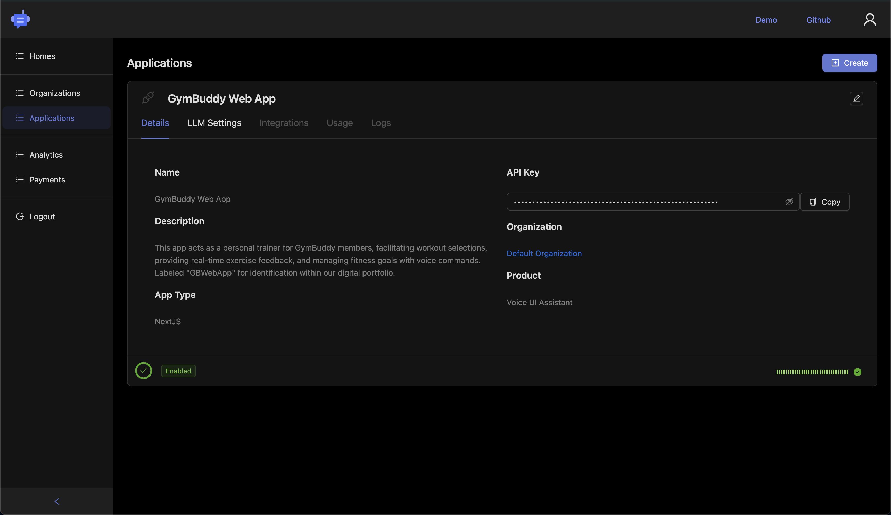

# AI Voice Assistant (ReactJS)

Give your App a voice, with a conversational AI assistant and interactive voice UI **in less than 10 minutes**!

**No Code Changes! No Intent Definitions!** _Just add our magic button `<AiAssistantButton />`._

## Demo

Try it [here](https://smart.sista.ai/?utm_source=github_repo&utm_medium=demo_button&utm_campaign=react_sdk_readme). Click the round button located at the bottom right corner.

 

	

## Features at a Glance

- **AI Assistant:** Answers any question
- **UI Controller:** Performs any action
- **Context Awareness:** Read any screen
- **Voice UI:** Speaks any language
- **Admin Panel:** Customizes any detail

## Plug & Play AI Integration

Integrating AI into your applications is now simpler than ever. The [Admin Panel](https://admin.sista.ai/applications) offers full control, customization, powerful analytics, and detailed insights to optimize user experiences.

> Sista AI: 🤖 Your AI Integration Platform. ❤️

 

	

## Supported React Projects

This package supports a diverse range of React-based projects:

|                                                                                                      |                                                                                                           |                                                                                                      |                                                                                                     |                                                                                                      |
| :--------------------------------------------------------------------------------------------------: | :-------------------------------------------------------------------------------------------------------: | :--------------------------------------------------------------------------------------------------: | :-------------------------------------------------------------------------------------------------: | :--------------------------------------------------------------------------------------------------: |
|      |      |       |    |  |
|   |   |       |    |  |

## Supported Platforms

Our AI technology is supported across all platforms, delivering a unified experience for users everywhere.

|                                                                                                      |                                                                                                           |                                                                                                      |                                                                                                     |                                                                                                      |                                                                                                        |                                                                                                        |
| :--------------------------------------------------------------------------------------------------: | :-------------------------------------------------------------------------------------------------------: | :--------------------------------------------------------------------------------------------------: | :-------------------------------------------------------------------------------------------------: | :--------------------------------------------------------------------------------------------------: | :----------------------------------------------------------------------------------------------------: | :----------------------------------------------------------------------------------------------------: |
|       |    |    |      |       |     |  |
|  |      |  |  |   |   |     |

## Support

For issues, raise on Github or contact [support@sista.ai](mailto:support@sista.ai).

Join our community on [Discord](https://discord.gg/e2arxq9Js4) to connect with other users.

 
 

	

## Contributing

Your contributions are warmly welcomed! Let's collaborate 🤝

## License

Licensed under [CC BY-NC-ND 3.0](./LICENSE).

 

