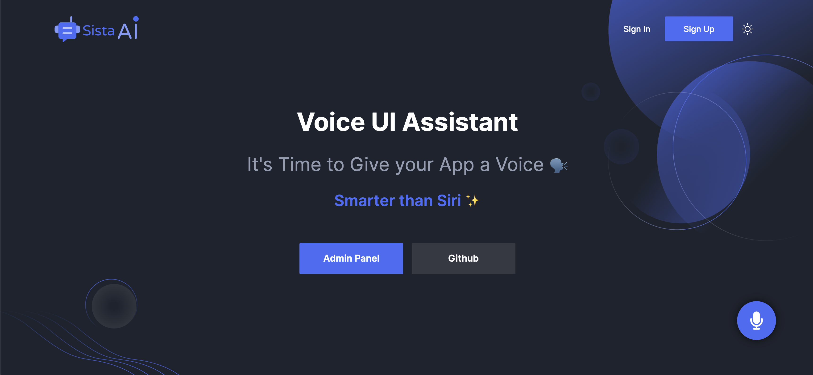

# Voice UI Assistant

Turn your App into an AI-powered, Voice-controlled interface **in less than 10 minutes**!

__No Code Changes or Intent Definitions!__ *Just add our magic button `<AiAssistantButton />`.*


[](https://vuic.sista.ai)

> Sista AI: 🤖 Your AI Integration Platform. ❤️

**Features at a Glance:**
- **UI Controller:** Performs any action
- **Voice UI:** Speaks any language
- **AI Assistant:** Answers any question
- **Admin Panel:** Customizes any detail


## Demo

### Try it now!

Visit our [Demo](https://vuic.sista.ai) click the button, and start talking... Say "turn the light on"!__


[](https://vuic.sista.ai)


## Supported Projects

This package integrates with many React projects.

- Create React App
- React Native
- Next.js
- Gatsby
- Electron
- Meteor
- Parcel
- Expo
- Remix
- Storybook
- RedwoodJS
- Blitz.js


## Installation

To use [@sista/ai-assistant-react](https://www.npmjs.com/package/@sista/ai-assistant-react), install it in your React App.

##### Using npm:
```bash
npm install @sista/ai-assistant-react
```

##### Using yarn:
```bash
yarn add @sista/ai-assistant-react
```

<!-- ##### Using pnpm:
```bash
pnpm add @sista/ai-assistant-react
``` -->


## Setup

### 1. Import Provider

Import `AiAssistantProvider` and wrap your App at the root level.

```jsx
// ...
import { AiAssistantProvider } from "@sista/ai-assistant-react";

ReactDOM.render(
  <React.StrictMode>
    <AiAssistantProvider apiKey="YOUR_API_KEY"> // << Wrap your app with this provider
      <App />
    </AiAssistantProvider>
  </React.StrictMode>,
  // ...
);
```

Get your **free** `API key` from the [Admin Panel](https://admin.sista.ai/applications) and replace `"YOUR_API_KEY"`.


### 2. Import Button

Import `AiAssistantButton` and add it wherever you want.

```js
// ...
import { AiAssistantButton } from "@sista/ai-assistant-react";

// ...
function MyComponent() {
  return (
    <div>
      // ...
      <AiAssistantButton />  // << Add the magic button anywhere
    </div>
  );
}
```


> 🎉 Congrats! Press the button, start talking, and enjoy!

---


### 3. Register Voice-Interactive Functions

To make your UI voice-interactive, simply register an `array` of `function signatures` to the **Sista AI model**.

```js
const sayHelloWorld = () => {
  console.log("Hello, World!");
};

// Define the functions to be voice-controlled
const interactiveFunctions = [
  {
    function: {
      handler: sayHelloWorld, // pass a refference to your function
      description: "Greets the user with Hello World :)", // add function description
    },
  },
  // ... register additional functions here
];
```


For functions that accepts parameters:

```js
const sayHello = (name) => {
  console.log(`Hello ${name}!`);
};

// Define the functions to be voice-controlled
const interactiveFunctions = [
  {
    function: {
      handler: sayHello,
      description: "Greets the user with their name.",
      // In case your function accepts parameters:
      parameters: {
        type: "object",
        properties: {
          name: { 
            type: "string", // set parameter type
            description: "User's name." // add parameter description
          },
        },
        required: ["name"], // list required parameters
      },
    },
  },
];
```


Register the functions with `aiAssistant.registerFunctions(..);` inside a `useEffect` hook.

```js
  const aiAssistant = useAiAssistant();
  useEffect(() => {
    if (aiAssistant) {
      aiAssistant.registerFunctions(interactiveFunctions);
    }
  }, [aiAssistant]);
```

> Just like that, your app is voice-interactive. Magic! :sparkles:


To customize the AI assistant's voice or feed information about your product, visit the [Admin Panel](https://admin.sista.ai/applications).


## Full Example: (Todo App)

For a voice-interactive todo app to `add` or `remove` tasks, the setup is:

```js
import React, { useEffect } from 'react';
import { useAiAssistant, AiAssistantButton } from '@sista/ai-assistant-react';

function TodoApp() {

  const addTask = (task) => {
    console.log(`Task added: ${task}`);
  };

  const removeTask = (task) => {
    console.log(`Task removed: ${task}`);
  };

  // ...

  // Initialize the aiAssistant instance
  const aiAssistant = useAiAssistant();

  useEffect(() => {
    // Define the voice-controlled functions
    const interactiveFunctions = [
      {
        function: {
          handler: addTask,
          description: 'Adds a new task.',
          parameters: {
            type: 'object',
            properties: {
              task: { 
                type: 'string', 
                description: 'Description of the task.' 
              },
            },
            required: ['task'],
          },
        },
      },
      {
        function: {
          handler: removeTask,
          description: 'Removes an existing task.',
          parameters: {
            type: 'object',
            properties: {
              task: { 
                type: 'string', 
                description: 'Description of the task.' 
              },
            },
            required: ['task'],
          },
        },
      },
    ];

    // Register the AI controlled functions
    if (aiAssistant) {
      aiAssistant.registerFunctions(interactiveFunctions);
    }
  }, [aiAssistant]);

  // ...

  return (
    <div>
      // ...
      <AiAssistantButton />
    </div>
  );
}

export default TodoApp;
```

---


## Configuration

`AiAssistantProvider` accepts few props:

```jsx
<AiAssistantProvider
  apiKey="api-key"   // (required): Your API key.
  debug={true}       // (optional): Enables debug mode.
  apiUrl="api-url"   // (optional): For custom backend or testing purposes.
>
  // ...
</AiAssistantProvider>
```

---

## Customization

### Change Button Color

You can modify the colors of the `AiAssistantButton` at different states:

```js
    const colors = {
        STATE_IDLE: '#4a6cf6', // Default
        STATE_LISTENING_START: '#F64A7B', // Red
        STATE_THINKING_START: '#4ac2f6', // Blue
        STATE_SPEAKING_START: '#4af67f', // Green
    };

  <AiAssistantButton buttonColors={colors} />
```

### Modify AI Responses

Customize AI assistant behavior via the [Admin Panel](https://admin.sista.ai/applications) by providing your `custom prompt` and `training data`.


### Change Assistant Voice

Change AI assistant's voice via the [Admin Panel](https://admin.sista.ai/applications) by selecting your preferred voice in the application settings.


[](https://vuic.sista.ai)

---


<a href="https://vuic.sista.ai">
  
</a>

Unlock the Future with our advacned **Voice UI Assistant**: Embrace top-tier components:
- Voice UI Controller
- Natural Language Understanding Engine
- Text-to-Executable Translator
- Audio-to-Text / Text-to-Audio Conversion
- Intent Recognition and Handling
- Contextual Response Generator
- Custom Prompt Configuration
- Analytics and Logging
- Privacy and Security


## Contributing

Your contributions are warmly welcomed! Let's collaborate 🤝

## License

Licensed under [CC BY-NC-ND 3.0](./LICENSE).

## Support

For issues, raise on Github or contact [support@sista.ai](mailto:support@sista.ai).